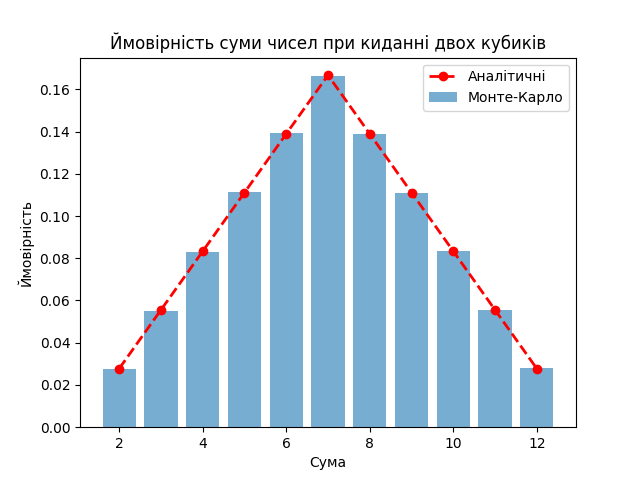

# goit-algo-fp
# Симуляція кидків кубиків

Це завдання імітує велику кількість кидків кубиків для обчислення ймовірностей сум чисел, які випадають при киданні двох кубиків. Результати порівнюються з теоретичними ймовірностями, обчисленими аналітично.

## Опис

Симуляція передбачає кидання двох шестигранних кубиків велику кількість разів (1,000,000 кидків). Для кожного кидка записується сума чисел на обох кубиках. Програма обчислює частоту кожної можливої суми (від 2 до 12) та обчислює ймовірності на основі цих частот.

## Аналітичні ймовірності

Теоретичні ймовірності для кожної можливої суми при киданні двох шестигранних кубиків є такими:

| Сума | Ймовірність |
|------|-------------|
| 2    | 2.78% (1/36)|
| 3    | 5.56% (2/36)|
| 4    | 8.33% (3/36)|
| 5    | 11.11% (4/36)|
| 6    | 13.89% (5/36)|
| 7    | 16.67% (6/36)|
| 8    | 13.89% (5/36)|
| 9    | 11.11% (4/36)|
| 10   | 8.33% (3/36)|
| 11   | 5.56% (2/36)|
| 12   | 2.78% (1/36)|

## Результати симуляції

Після проведення симуляції ймовірності для кожної суми були обчислені за допомогою методу Монте-Карло. Результати симуляції порівнювалися з аналітичними ймовірностями.

## Візуалізація

Наступний графік візуалізує порівняння між симульованими ймовірностями та аналітичними ймовірностями:

## Висновок

Графік показує, що ймовірності, отримані з симуляції (сині стовпці), тісно співпадають з теоретичними ймовірностями (червоні точки та пунктирна лінія). Це підтверджує точність та надійність методу симуляції, використаного у цьому завдані.
